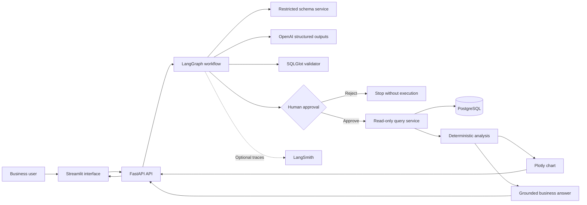
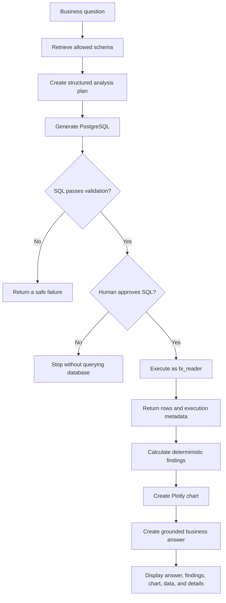
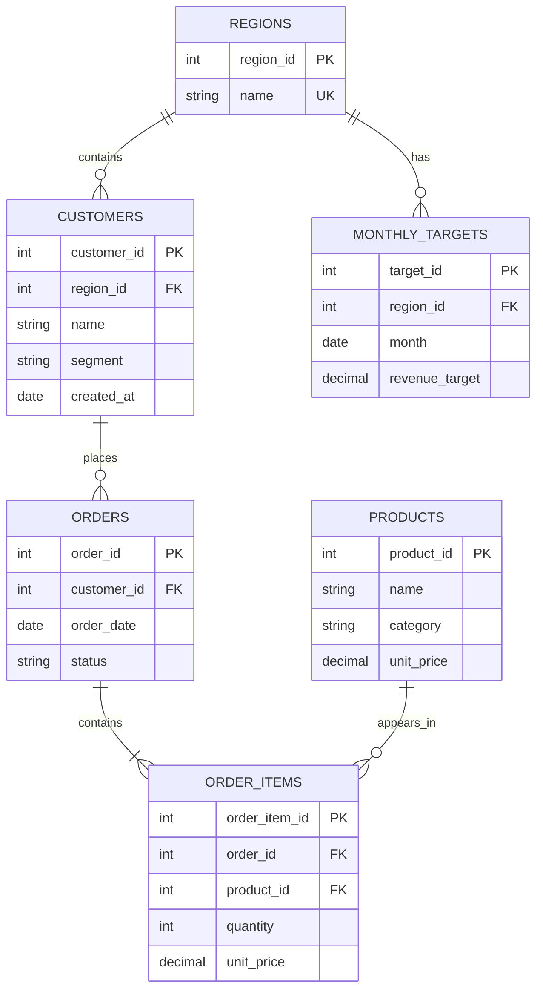

# Agentic Analytics and Business Intelligence Copilot

A safe, human-approved analytics copilot that converts a business question into an analysis plan, generates read-only PostgreSQL, validates it, pauses for approval, executes it, detects unusual trends, and presents the result through an interactive Streamlit interface.

The primary supported question is:

> Compare revenue across regions for the last six complete months, identify unusual declines, and generate a suitable chart.

## Demo outcome

For the deterministic retail dataset, the application produces:

- Analysis period: February 2026 through July 2026
- Highest-revenue region: North
- North revenue: $323,068.40
- Query result: 24 regional monthly rows
- Unusual decline rule: month-over-month revenue change below -25%
- Unusual declines:
  - West, March 2026: -25.82%
  - South, May 2026: -54.82%
  - West, July 2026: -72.12%

The result is repeatable because the database uses a fixed seed and a fixed data-as-of date of July 31, 2026.

## Key capabilities

- Natural-language analytical question input
- Restricted PostgreSQL schema discovery
- Structured LLM analysis planning
- Structured LLM SQL generation
- SQL parsing and validation with SQLGlot
- Human approval before query execution
- Read-only PostgreSQL application role
- Transaction-level read-only enforcement
- Five-second statement timeout
- Maximum result size of 500 rows
- Deterministic revenue and decline analysis
- Interactive Plotly chart
- Business-language explanation
- Three suggested follow-up questions
- FastAPI backend
- Streamlit frontend
- LangGraph workflow with interruption and resumption
- Optional LangSmith tracing
- Unit and integration test coverage

## Architecture



## Runtime workflow



The SQL is generated before approval, but it is not executed until the user explicitly selects **Approve and execute**.

## Data model



## Business rules

Revenue is defined consistently as:

```text
SUM(order_items.quantity * order_items.unit_price)
```

Additional rules:

- Only orders with `status = 'completed'` count toward revenue.
- The dataset ends on July 31, 2026.
- The last six complete months are February through July 2026.
- January 2026 is included internally as a lookback month so that February’s month-over-month change can be calculated.
- An unusual decline is a month-over-month revenue change below -25%.

## Security design

The application uses defense in depth. Prompt instructions are not treated as a security boundary.

| Layer | Protection |
|---|---|
| Schema service | Exposes only approved retail tables and relationships |
| Structured LLM output | Requires SQL and planning responses to match Pydantic schemas |
| SQLGlot validator | Parses SQL and rejects unsafe syntax |
| Statement policy | Allows one read-only statement |
| Operation policy | Rejects writes, DDL, and prohibited operations |
| Table policy | Rejects tables outside the allowlist |
| Schema policy | Rejects unauthorized schemas such as `pg_catalog` |
| Function policy | Rejects prohibited functions such as `pg_sleep` |
| Row policy | Requires a result limit no greater than 500 |
| Database role | Connects as `bi_reader`, not the administrator |
| Transaction policy | Executes inside a read-only transaction |
| Timeout policy | Cancels statements after five seconds |
| Human approval | Requires explicit approval before execution |

A rejected query never reaches the database execution node.

## Technology stack

- Python 3.11
- uv
- FastAPI
- Streamlit
- LangGraph
- OpenAI Responses API with structured outputs
- PostgreSQL 16
- SQLAlchemy
- psycopg
- SQLGlot
- Pandas
- Plotly
- Pydantic
- Pytest
- Ruff
- Docker Compose
- Optional LangSmith tracing

## Repository structure

```text
agentic-bi-copilot/
├── src/agentic_bi_copilot/
│   ├── agent/
│   │   ├── graph.py
│   │   ├── nodes.py
│   │   └── state.py
│   ├── api/
│   │   ├── main.py
│   │   └── routes.py
│   ├── database/
│   │   ├── connection.py
│   │   ├── models.py
│   │   ├── query_service.py
│   │   └── schema_service.py
│   ├── security/
│   │   └── sql_validator.py
│   ├── services/
│   │   ├── analysis.py
│   │   ├── charts.py
│   │   ├── llm.py
│   │   └── manual_pipeline.py
│   ├── config.py
│   └── schemas.py
├── scripts/
│   ├── init_database.sql
│   ├── run_agent_demo.py
│   └── seed_database.py
├── tests/
│   ├── evaluation/
│   ├── integration/
│   └── unit/
├── ui/
│   └── streamlit_app.py
├── .env.example
├── docker-compose.yml
├── pyproject.toml
├── uv.lock
└── README.md
```

## Prerequisites

Install:

- Python 3.11
- uv
- Git
- Docker Desktop

Verify them:

```bash
python3 --version
uv --version
git --version
docker --version
```

## Local setup

### 1. Enter the repository

```bash
cd ~/Documents/agentic-bi-copilot
```

This makes the repository the current working directory.

### 2. Install the locked dependencies

```bash
uv sync
```

This creates or updates `.venv` and installs the exact project dependencies recorded in `uv.lock`.

### 3. Create the local environment file

```bash
cp .env.example .env
```

This creates a private configuration file from the safe template.

Add a valid OpenAI API key to `.env`:

```text
OPENAI_API_KEY=your-api-key
```

Never commit `.env` or paste its contents into terminal output, documentation, screenshots, or chat messages.

Confirm that Git ignores it:

```bash
git check-ignore -v .env
```

### 4. Start PostgreSQL

```bash
docker compose up -d postgres
```

This starts the local PostgreSQL 16 container in the background.

Verify its health:

```bash
docker compose ps
```

The `agentic-bi-postgres` container should report `healthy`.

### 5. Seed the deterministic dataset

```bash
uv run python scripts/seed_database.py
```

This recreates and populates the six retail tables using a fixed random seed.

Expected approximate counts:

| Table | Rows |
|---|---:|
| regions | 4 |
| customers | 1,000 |
| products | 100 |
| orders | 5,125 |
| order_items | 12,752 |
| monthly_targets | 96 |

## Running the application

The API and UI run in separate terminals.

### Terminal A: start FastAPI

```bash
uv run uvicorn agentic_bi_copilot.api.main:app \
  --host 127.0.0.1 \
  --port 8000
```

The API is available at:

- Health endpoint: <http://127.0.0.1:8000/health>
- Interactive API documentation: <http://127.0.0.1:8000/docs>

Do not use automatic reload between SQL generation and approval. The MVP stores active LangGraph runs in memory, so restarting the API invalidates pending runs.

### Terminal B: start Streamlit

```bash
uv run streamlit run ui/streamlit_app.py \
  --server.address 127.0.0.1 \
  --server.port 8501
```

Open:

<http://127.0.0.1:8501>

## Using the interface

1. Enter the primary business question.
2. Select **Generate analysis plan and SQL**.
3. Review the interpreted question, plan, assumptions, tables, validation checks, and SQL.
4. Select **Approve and execute** to run the read-only query.
5. Alternatively, select **Reject SQL** to stop without execution.
6. Review:
   - Business answer
   - Revenue metrics
   - Unusual declines
   - Suggested follow-up questions
   - Interactive chart
   - Query-result table
   - Analysis plan
   - SQL safety checks
   - Executed SQL

## Command-line demonstration

Run:

```bash
uv run python scripts/run_agent_demo.py
```

The script:

1. Starts the LangGraph workflow.
2. Displays the generated SQL and safety result.
3. Pauses for approval.
4. Executes only after the user enters `APPROVE`.
5. Prints the business answer and unusual declines.

The installed helper command prints application startup instructions:

```bash
uv run agentic-bi-copilot
```

## API endpoints

| Method | Endpoint | Purpose |
|---|---|---|
| `GET` | `/health` | Check backend availability |
| `POST` | `/api/v1/manual-query` | Run the deterministic reference pipeline |
| `POST` | `/api/v1/agent/runs` | Start an agent run and prepare an approval request |
| `POST` | `/api/v1/agent/runs/{thread_id}/decision` | Approve or reject a pending run |

### Start an agent run

Request:

```json
{
  "question": "Compare revenue across regions for the last six complete months and identify unusual declines."
}
```

The response contains:

- Thread identifier
- Structured analysis plan
- Generated SQL
- SQL explanation
- Referenced tables
- Validation checks
- Approval status

### Resume an agent run

Approval request:

```json
{
  "approved": true,
  "feedback": null
}
```

Rejection request:

```json
{
  "approved": false,
  "feedback": "Do not execute this query."
}
```

## Testing

PostgreSQL must be running before executing the complete test suite.

Run code-quality checks:

```bash
uv run ruff check .
```

Run all tests:

```bash
uv run pytest -v
```

Check whitespace:

```bash
git diff --check
```

Current verified result:

```text
63 passed
```

The suite covers:

- API health
- Database connectivity
- Read-only role enforcement
- Query execution
- Result row limits
- Schema restrictions
- SQL parsing and normalization
- Unsafe SQL rejection
- Prohibited functions
- Agent planning
- SQL generation
- Human approval
- Rejection routing
- Approved execution
- Deterministic analysis
- Plotly chart generation
- Follow-up questions
- Resumable agent API behavior

## Evaluation strategy

The trusted SQL reference is stored at:

```text
tests/evaluation/regional_revenue_last_six_months.sql
```

The primary generated SQL is evaluated against this reference using:

- Safety validation status
- Referenced-table allowlist
- Output row count
- Exact returned rows
- Lookback-period correctness
- Revenue totals
- Top-region correctness
- Unusual-decline correctness

The verified generated query returned an exact 24-row match with the trusted reference result.

## Optional LangSmith tracing

The repository includes LangSmith configuration variables:

```text
LANGSMITH_TRACING=true
LANGSMITH_API_KEY=
LANGSMITH_PROJECT=agentic-bi-copilot
```

To enable tracing, supply a valid LangSmith key and export the variables before starting the API. Tracing is optional; the local application and tests do not require it.

Never commit LangSmith or OpenAI credentials.

## Known limitations

This is a focused portfolio MVP rather than a production analytics platform.

- The deterministic analysis layer is tailored to regional monthly revenue.
- General-purpose analytical questions may require additional analysis handlers.
- Active agent runs use an in-memory LangGraph checkpointer.
- Pending approval runs are lost when the API process restarts.
- The API should run as a single process for this local MVP.
- There is no authentication or authorization UI.
- There is no tenant isolation.
- There is no long-term conversation memory.
- There is no cloud deployment configuration.
- There is no streaming response or cancellation support.
- LLM output can vary, although deterministic security and analysis checks remain enforced.
- Human approval is required for every generated query.

## Future improvements

- Persistent PostgreSQL or Redis-backed LangGraph checkpoints
- Multiple supported analysis types
- A curated question router
- SQL repair with strictly bounded retries
- Authentication and role-based access
- Conversation history
- Evaluation dashboards
- Token and cost reporting
- Streaming progress
- Cloud deployment
- MCP database adapters
- Expanded LangSmith evaluation datasets

## Stopping the application

Stop FastAPI and Streamlit with `Control + C` in their respective terminals.

Stop PostgreSQL while preserving its data:

```bash
docker compose down
```

Start it again later with:

```bash
docker compose up -d postgres
```

## Project status

Version `0.1.0` is a complete local MVP for the primary regional-revenue analysis workflow.

It demonstrates:

- Agent orchestration
- Structured LLM outputs
- Safe SQL generation
- Human-in-the-loop approval
- Database least privilege
- Deterministic analytics
- Interactive business intelligence
- Automated testing