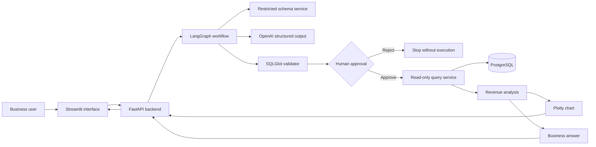
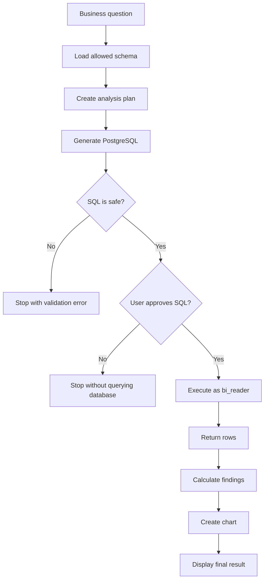
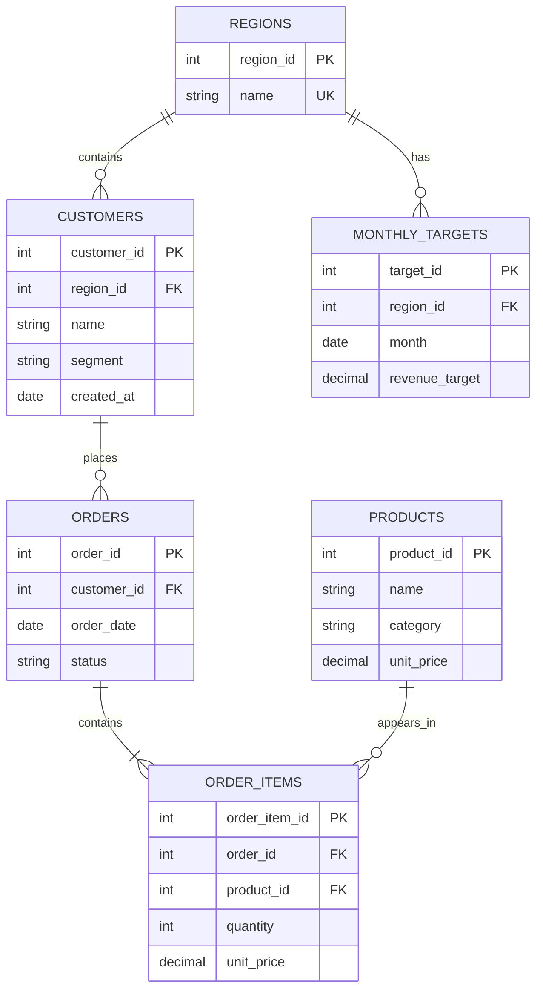

# Agentic Analytics and Business Intelligence Copilot

A local business intelligence application that turns a business question into a safe, reviewable database analysis.

The application can:

1. Understand a business question.
2. Inspect the allowed database tables.
3. Create an analysis plan.
4. Generate PostgreSQL.
5. Check the SQL for unsafe operations.
6. Pause and ask the user for approval.
7. Execute the query using a read-only database account.
8. Analyze the returned data.
9. Display an answer, findings, chart, and query details.

The main supported question is:

> Compare revenue across regions for the last six complete months, identify unusual declines, and generate a suitable chart.

## Demo result

The project uses a fixed retail dataset, so the main result is repeatable.

| Result | Value |
|---|---|
| Analysis period | February 2026 to July 2026 |
| Highest-revenue region | North |
| North revenue | $323,068.40 |
| Returned rows | 24 |
| Agent decline threshold | More than 25% month-over-month decline |

The unusual declines are:

| Region | Month | Revenue change |
|---|---|---:|
| West | March 2026 | -25.82% |
| South | May 2026 | -54.82% |
| West | July 2026 | -72.12% |

The dataset ends on July 31, 2026. January 2026 is loaded as a lookback month so the application can calculate the February change correctly.

## Main features

- Natural-language business question
- Restricted database schema discovery
- Structured analysis planning
- Structured SQL generation
- SQL validation with SQLGlot
- Human approval before execution
- Read-only PostgreSQL user
- Read-only database transaction
- Five-second query timeout
- Maximum result size of 500 rows
- Revenue and decline analysis
- Interactive Plotly chart
- Business summary
- Suggested follow-up questions
- FastAPI backend
- Streamlit interface
- LangGraph workflow
- Optional LangSmith tracing
- Unit and integration tests

## Architecture



## Agent workflow



The model generates SQL before approval, but the SQL is not executed until the user selects **Approve and execute**.

## Database model



## Business rules

Revenue is calculated as:

```text
SUM(order_items.quantity * order_items.unit_price)
```

The main rules are:

- Only completed orders count toward revenue.
- The dataset ends on July 31, 2026.
- The requested six-month period is February through July 2026.
- January 2026 is used only to calculate February’s previous-month value.
- The agent treats a decline greater than 25% as unusual.
- The deterministic manual reference pipeline uses its original 20% threshold.
- Percentage changes are rounded to two decimal places.

## Security

The project uses several safety layers. It does not depend only on the model prompt.

| Safety layer | Purpose |
|---|---|
| Restricted schema service | Shows the model only approved tables and columns |
| Pydantic models | Require structured plans and SQL drafts |
| SQLGlot parser | Parses SQL before execution |
| Single-statement rule | Rejects multiple SQL statements |
| Read-only rule | Rejects writes and database changes |
| Table allowlist | Rejects unknown tables |
| Schema allowlist | Rejects unauthorized schemas |
| Function blocklist | Rejects dangerous functions such as `pg_sleep` |
| Required limit | Requires `LIMIT 500` or less |
| Human approval | Requires the user to approve SQL |
| `bi_reader` role | Prevents database writes |
| Read-only transaction | Adds another database-level write restriction |
| Statement timeout | Stops queries after five seconds |

A rejected or unsafe query never reaches the query execution step.

## Technology stack

| Technology | Role |
|---|---|
| Python 3.11 | Main programming language |
| uv | Dependency and virtual-environment management |
| FastAPI | Backend API |
| Streamlit | User interface |
| LangGraph | Agent workflow and approval interruption |
| OpenAI Responses API | Structured planning and SQL generation |
| PostgreSQL 16 | Retail database |
| SQLAlchemy | Database connections and models |
| psycopg | PostgreSQL driver |
| SQLGlot | SQL parsing and safety validation |
| Pydantic | Request, response, and model-output validation |
| Pandas | Table and chart-data preparation |
| Plotly | Interactive charts |
| Faker | Synthetic retail data |
| Pytest | Automated tests |
| Ruff | Formatting and code-quality checks |
| Docker Compose | Local PostgreSQL management |
| LangSmith | Optional workflow tracing |

## Project structure

```text
agentic-bi-copilot/
├── scripts/
│   ├── init_database.sql
│   ├── run_agent_demo.py
│   └── seed_database.py
├── src/
│   └── agentic_bi_copilot/
│       ├── agent/
│       │   ├── graph.py
│       │   ├── nodes.py
│       │   └── state.py
│       ├── api/
│       │   ├── main.py
│       │   └── routes.py
│       ├── database/
│       │   ├── connection.py
│       │   ├── models.py
│       │   ├── query_service.py
│       │   └── schema_service.py
│       ├── security/
│       │   └── sql_validator.py
│       ├── services/
│       │   ├── analysis.py
│       │   ├── charts.py
│       │   ├── llm.py
│       │   └── manual_pipeline.py
│       ├── config.py
│       └── schemas.py
├── tests/
│   ├── evaluation/
│   ├── integration/
│   └── unit/
├── ui/
│   └── streamlit_app.py
├── .env.example
├── docker-compose.yml
├── pyproject.toml
├── uv.lock
└── README.md
```

## Requirements

Install these tools before starting:

- Python 3.11
- uv
- Git
- Docker Desktop

Check that they are installed:

```bash
python3 --version
uv --version
git --version
docker --version
```

These commands print the installed versions.

## Setup

### 1. Open the project folder

```bash
cd ~/Documents/agentic-bi-copilot
```

This makes the project folder your current terminal location.

### 2. Install the project

```bash
uv sync
```

This command:

- Creates `.venv` if needed.
- Installs the project.
- Installs the dependencies recorded in `uv.lock`.

### 3. Create the local environment file

```bash
cp .env.example .env
```

This copies the safe example configuration into a private local file.

Open `.env` and provide:

```text
OPENAI_API_KEY=your-private-api-key
MODEL_NAME=your-model-name
```

Do not commit `.env`. Do not paste its contents into documentation, screenshots, terminal output, or chat messages.

Confirm that Git ignores it:

```bash
git check-ignore -v .env
```

This should show that `.env` is excluded by `.gitignore`.

### 4. Start PostgreSQL

```bash
docker compose up -d postgres
```

This starts PostgreSQL in the background.

Check its status:

```bash
docker compose ps
```

Wait until `agentic-bi-postgres` reports `healthy`.

### 5. Create the retail dataset

```bash
uv run python scripts/seed_database.py
```

This recreates and fills the six retail tables using a fixed random seed.

Expected row counts:

| Table | Rows |
|---|---:|
| regions | 4 |
| customers | 1,000 |
| products | 100 |
| orders | 5,125 |
| order_items | 12,752 |
| monthly_targets | 96 |

The seed script recreates these local tables. Do not run it against a database containing important data.

## Run the application

The backend and interface run in separate terminals.

### Terminal 1: start FastAPI

```bash
uv run uvicorn agentic_bi_copilot.api.main:app \
  --host 127.0.0.1 \
  --port 8000
```

This starts the backend at:

```text
http://127.0.0.1:8000
```

Useful pages:

- Health check: <http://127.0.0.1:8000/health>
- API documentation: <http://127.0.0.1:8000/docs>

Do not use automatic reload while a run is waiting for approval. Pending runs are stored in memory, so restarting the API removes them.

### Terminal 2: start Streamlit

```bash
uv run streamlit run ui/streamlit_app.py \
  --server.address 127.0.0.1 \
  --server.port 8501
```

This starts the interface at:

<http://127.0.0.1:8501>

## Use the interface

1. Enter the business question.
2. Select **Generate analysis plan and SQL**.
3. Review the analysis plan.
4. Review the referenced tables.
5. Review the SQL safety checks.
6. Read the generated SQL.
7. Select **Approve and execute** or **Reject SQL**.
8. If approved, review the answer, metrics, findings, chart, data, and audit details.

## Command-line demonstration

Run:

```bash
uv run python scripts/run_agent_demo.py
```

This script:

1. Starts the agent workflow.
2. Displays the analysis question.
3. Displays the SQL and its safety result.
4. Waits for approval.
5. Executes only when you type `APPROVE`.
6. Prints the result and unusual declines.

You can also run:

```bash
uv run agentic-bi-copilot
```

This prints the commands used to start the API and interface.

## API endpoints

| Method | Endpoint | Purpose |
|---|---|---|
| `GET` | `/health` | Check whether the backend is running |
| `POST` | `/api/v1/manual-query` | Run the deterministic reference analysis |
| `POST` | `/api/v1/agent/runs` | Generate a plan and SQL approval request |
| `POST` | `/api/v1/agent/runs/{thread_id}/decision` | Approve or reject a pending run |

### Start an agent run

Example request:

```json
{
  "question": "Compare revenue across regions for the last six complete months and identify unusual declines."
}
```

The response includes:

- Thread ID
- Analysis plan
- Generated SQL
- SQL explanation
- Referenced tables
- Safety checks
- Approval status

### Approve a run

```json
{
  "approved": true,
  "feedback": null
}
```

### Reject a run

```json
{
  "approved": false,
  "feedback": "Do not execute this query."
}
```

## Testing

PostgreSQL must be healthy before running all integration tests.

Check the code:

```bash
uv run ruff check .
```

This checks imports, style, and common code problems.

Run all tests:

```bash
uv run pytest -v
```

This runs the unit and integration tests.

Check whitespace:

```bash
git diff --check
```

This reports trailing spaces and other whitespace problems.

The project contains 63 tests covering:

- Health endpoint
- Database connection
- Read-only database role
- Query execution
- Query row limits
- Schema discovery
- SQL validation
- Unsafe SQL rejection
- Analysis calculations
- Chart generation
- Structured LLM planning
- Structured SQL generation
- Human approval
- Query rejection
- Agent routing
- Agent API
- Follow-up questions

## SQL evaluation

The trusted reference query is stored in:

```text
tests/evaluation/regional_revenue_last_six_months.sql
```

The generated SQL is compared with this query using:

- SQL safety result
- Referenced tables
- Returned row count
- Exact returned rows
- Revenue totals
- Top region
- Unusual declines
- January lookback logic

The verified generated query returned the same 24 rows as the reference query.

## Optional LangSmith tracing

LangSmith tracing is not required to run the application.

The available settings are:

```text
LANGSMITH_TRACING=true
LANGSMITH_API_KEY=
LANGSMITH_PROJECT=agentic-bi-copilot
```

To use tracing, add a valid LangSmith key to your private `.env` file.

Never commit an OpenAI or LangSmith API key.

## Why there is no requirements.txt

This project uses:

```text
pyproject.toml
uv.lock
```

`pyproject.toml` lists the project’s direct dependencies.

`uv.lock` records the exact resolved dependency versions.

Together, these files replace the usual `requirements.txt` workflow.

Install everything with:

```bash
uv sync
```

## Known limitations

This is a focused local MVP.

- The main analysis focuses on regional monthly revenue.
- Other business questions may require new analysis functions.
- Agent runs are stored in memory.
- Pending approvals are lost if the API restarts.
- The local API should use a single process.
- The application does not include user authentication.
- The application does not provide tenant isolation.
- It does not store long-term conversation history.
- It does not include cloud deployment configuration.
- It does not stream model responses.
- Model-generated plans and SQL may vary.
- Every generated query requires human approval.

## Possible future improvements

- Persistent LangGraph checkpoints
- More analysis types
- Business-question routing
- Bounded SQL repair
- User authentication
- Role-based access
- Conversation history
- Streaming workflow progress
- Cost and token reporting
- Evaluation dashboards
- Cloud deployment
- More evaluation questions

## Stop the application

Stop FastAPI and Streamlit by pressing `Control + C` in their terminals.

Stop PostgreSQL while keeping its stored data:

```bash
docker compose down
```

Start PostgreSQL again later:

```bash
docker compose up -d postgres
```

To remove the PostgreSQL volume and all local database data, you would need a separate destructive command. That command is intentionally not included here.

## Project status

Version `0.1.0` is a complete local MVP for the primary regional-revenue workflow.

It demonstrates:

- Agent workflow design
- Structured model output
- SQL safety validation
- Human approval
- Read-only database access
- Deterministic business analysis
- Interactive charts
- Automated testing